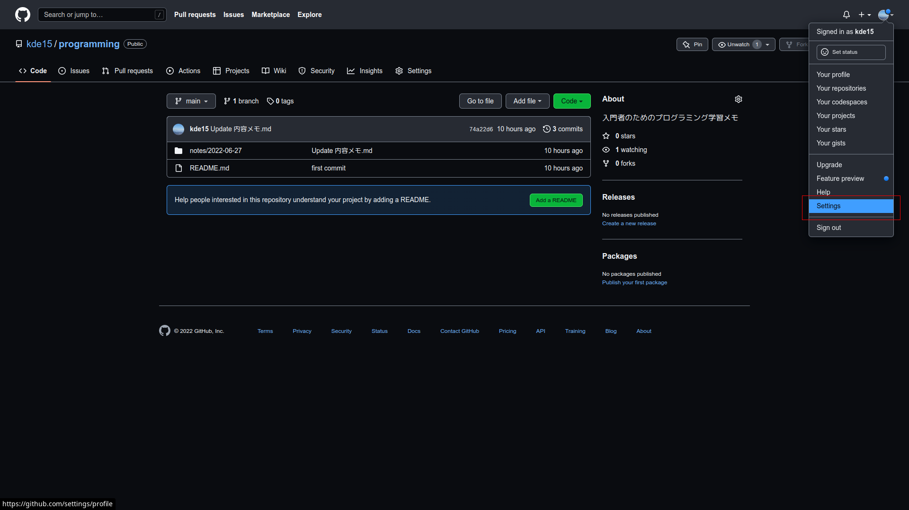
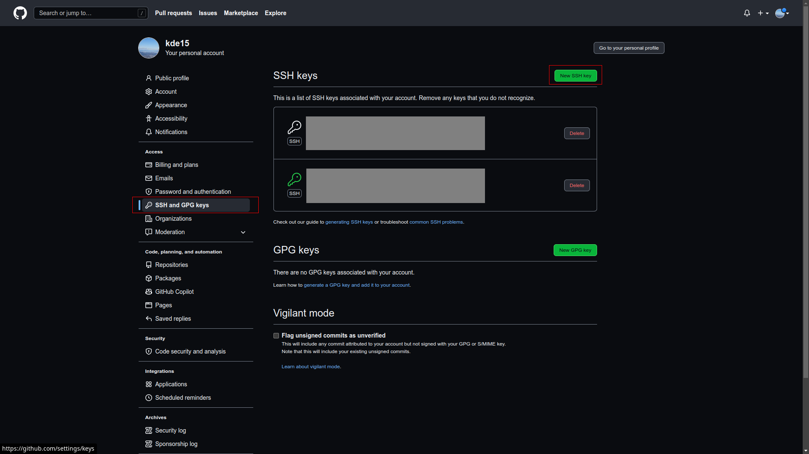
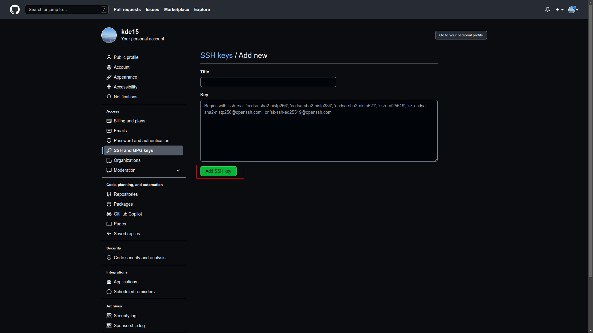

# 2022-06-27(月)
# 前提条件
以下がインストールされている
* Node.js
* WindowsならGitBash

GitHubアカウントを作成している

# JavaScript
JavaScriptをGitBashなどのローカル環境で動作させるにはNode.jsが必要

## Node.jsとは
JavaScriptは元々ブラウザのみで動作するものだった<br>
しかしそれだと不便なので、ブラウザ以外でもJavaScriptを動作させたいという需要が出てきた<br>
そこで出てきたのがNode.js<br>
Node.jsはJavaScriptをブラウザ以外で実行できるようにするランタイム(実行環境)<br>
ここでいうブラウザ以外というのは、例えばGitBashのようなターミナルなどのローカル環境のこと<br>
とりあえず`Node.js = JavaScript`という認識でok

## JavaScriptコードの実行方法
JavaScriptのプログラムを書いたファイルのファイル名には`.js`という拡張子をつける<br>
例えば`main.js`を実行したい場合は、ターミナルで以下のように実行する
```sh
node main.js
```

## JavaScriptの基礎文法
### 出力
`console.log();`は出力を行う
```js
console.log("hello world!"); // "hello world!"と出力される
```
これは動作確認時によくお世話になる

### コメント
コメントは`//`で表され、それ以降の文字は行末までプログラムとして扱われない
```js
// コメントです
```

複数行コメントというのもあり、`/* */`で囲った部分は全てコメントになる
```js
/*
この行も
この行も
この行も
コメントです
*/
```

### 変数
変数は`const`か`let`で宣言する(他にも`var`というのがあるが、これは古い機能なので使わない)<br>
`const`は再代入不可、`let`は再代入可
```js
// const変数宣言
const str1 = "immutable";
str1 = "overwrite"; // Error!

// let変数宣言
let str2 = "mutable";
str2 = "overwrite"; // OK!
// ↑再代入時は先頭にletキーワードがいらない
```
ちなみに`mutable`は変更可能、`immutable`は変更不可という意味で、プログラミングではよく出てくる

### 文字列結合
文字列同士を`+`記号で結合できる
```js
const str1 = "hello ";
const str2 = "world!";
const output = str1 + str2; // output is "hello world!"
```

### 数値演算
数値同士を`+`で加算できる
```js
const result = 100 + 200; // 300
```

`-`で減算できる
```js
const result1 = 300 - 100; // 200
// 結果がマイナス値でもok
const result2 = 100 - 500; // -400
```

乗算は`*`を使う
```js
const result = 3 * 5; // 15
```

除算は`/`を使う
```js
const result = 18 / 6; // 3
```

四則演算を組み合わせて使うこともできる
```js
// 算数と同じで、()内が先に計算される
const result = (3 * 7 - 1) / 5; // 4
```

おまけ<br>
`%`演算子というのもあって、これは除算の余りを取得できる
```js
// 20 / 3 = 6 ... 2 なのでresultは2となる
const result = 20 % 3; // 2
```
# ssh
sshとは公開鍵と秘密鍵で通信するプロトコル(通信ルール)のこと<br>
ローカルからGitHubにpushする際はこのsshを使って通信するのが一般的<br>
公開鍵は公開してokで、これをGitHubにアップロードする<br>
秘密鍵は誰にも公開してはいけないもので、ローカルに保持する

### 鍵の生成
`~/.ssh`フォルダを作成してから、以下を実行する
```sh
ssh-keygen -t rsa -b 4096 -N ""
```
生成する鍵名を聞かれるので、適当な鍵名を答える(ここでは`id_rsa`とする)<br>
すると`~/.ssh`に公開鍵と秘密鍵のペアが生成される<br>
`id_rsa.pub`が公開鍵、`id_rsa`が秘密鍵<br>
このうち公開鍵(`id_rsa.pub`のほう)を以下の手順でGitHubにアップロードする<br>

GitHubの右上メニューからSettingsを選択


左メニューの「SSH and GPG keys」を選択→「New SSH key」を押下


Titleに自分がわかるような名前を入力し、Keyに公開鍵の中身をペーストし、「Add SSH key」を押下


### 設定ファイルの作成
`~/.ssh/config`というファイルを作成し、そこにsshの設定を記載する<br>
GitHubに接続する場合は以下のような感じ
```
Host github
    HostName github.com
    IdentityFile ~/.ssh/id_rsa
    User git
```

# Git
Gitはプログラムの変更履歴を管理するためのツール<br>
Gitはローカルリポジトリとリモートリポジトリがある<br>
ローカルリポジトリは自分のPC上の特定のフォルダ<br>
リモートリポジトリはGitHub上に存在する

### リモートリポジトリの作成
GitHubの右上メニューから「Your repositories」を選択し、「New」を押下してリモートリポジトリを作成する

### アカウント情報設定
Gitはコミットするときにアカウント情報が設定されている必要がある<br>
ターミナルで以下のように実行して`user.name`と`user.email`を設定する
```sh
git config user.name <username>
git config user.email <email>
```
`<username>`と`<email>`には自分のGitHubアカウントのユーザー名とEmailを設定する

### ローカルリポジトリの作成
ローカルリポジトリにしたいフォルダで以下を実行する
```sh
git init
git remote add <host>:<username>/<repository-name>.git
```
* `<host>`には`~/.ssh/config`で設定したHostの部分を指定する(ここでは`github`)
* `<username>`には自分のGitHubアカウントのユーザー名を指定する
* `<repository-name>`にはリモートリポジトリ名を指定する

以下を実行してリモートリポジトリにpushする
```sh
git add .
git commit -m "first commit"
git branch -M main
git push -u origin main
```
GitHubを確認すると、リポジトリが更新されているのが確認できる

### リポジトリのclone
`git remote add`のときと同じように指定して、リモートリポジトリをローカルにcloneすることができる
```sh
git clone <host>:<username>/<repository-name>.git
```

# その他お役立ち情報
特定のコマンドについて詳細を知りたいときは`--help`を使う<br>
例えば`git push`コマンドについて知りたいときは以下のように実行すればよい
```sh
git push --help
```

## VSCodeのショートカットキー設定方法
「Ctrl + Shift + P」を入力して"key"と入力し、「Preferences: Open Keyboard Shortcuts」を選択するとショートカットキー設定が開く<br>
そこでショートカットキーを自由に設定できる
